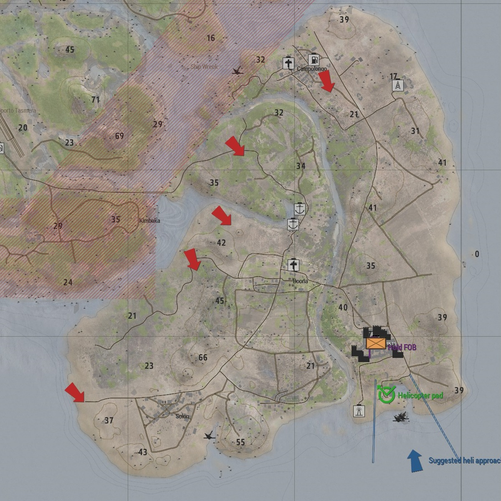
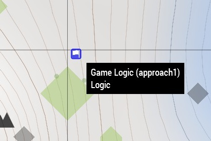
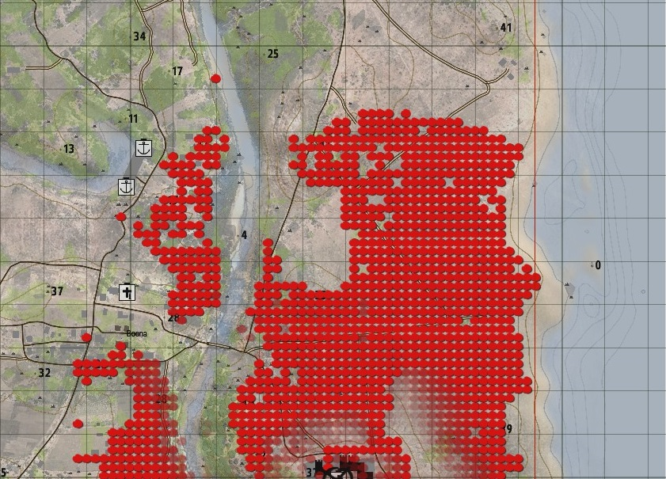
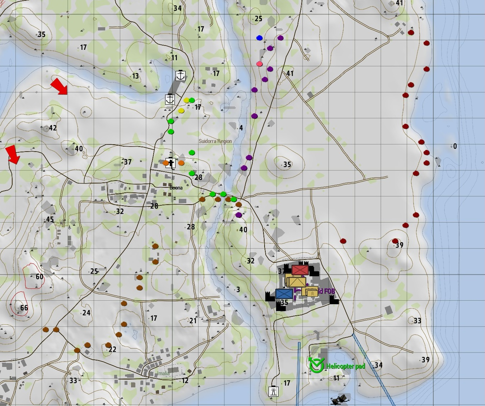
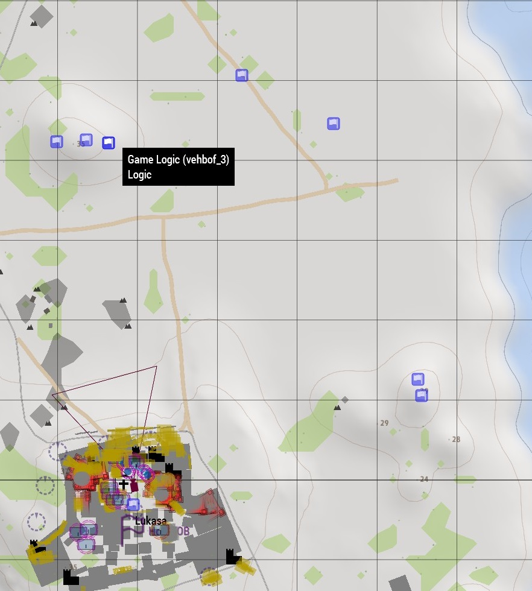
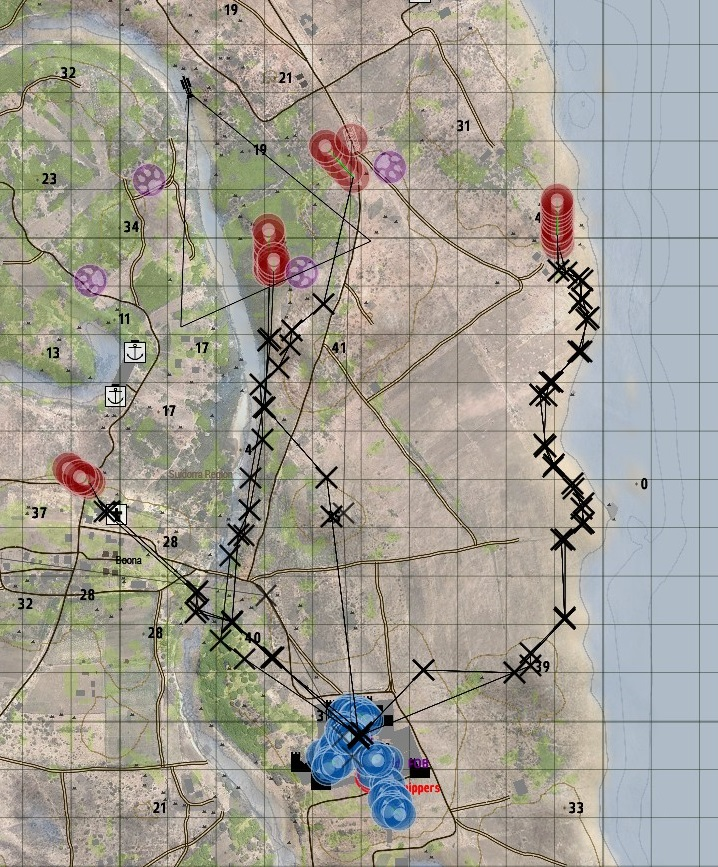

The first version of Aussie Holdout appeared in 2015, and has served as a hotbed for a few ideas. In 2018 I worked on upgrading it from the 2D to 3D editor and doing more experimentation.

# Mission Premise
The premise of this mission is for the players to hold a fixed position while waves of AI attack.

The enemy will use a combination of infantry forces and armoured vehicles with autocannons (e.g. BMP-2).

# AI Orders
A key area I wanted to explore in this mission is the ability for the AI to figure out what paths to take to advance to the defensive location. My scripts needed to handle the spawning and issuing orders (via waypoints) to the AI.

## AI spawn points.
An easy way to determine spawn points is to place game logics and give them a name. These can then be identified and used easily in code. These have the added advantage of being able to rapidly moved around in the mission editor.

The original version of the mission was made with Arma 3's 2D mission editor which would allow assigning waypoints to game logics. These were then copied to spawned groups, giving the mission maker plenty of control (via custom mission code).

Unfortunately the 3D editor removed the ability to assign waypoints to game logics, and so a new approach was required for assigning waypoints.

## Calculating AI movement orders

### Simple movement
An easy next step is to either simply have the AI move directly from the spawnpoint to the defense position by creating a waypoint on the defence objective. 

However this can lead to foolish choices such as walking across large open exposed areas where they can be easily picked off on their approach.

### Line of Sight Grid
A simple idea when attacking is to get as close as possible without the enemy being able to see you. A simple method to produce a reasonable approximation for the visibility of a position from another is by doing some intersection testing. Fortunately Arma 3 comes with a few scripting commands for checking for intersection across a line (akin to ray-casting). We then simply check if either terrain or objects block the visibility from two positions.

#TODO: Show line(?)

If we do this across the area by using a grid of points to approximate the area. We can produce a visualization like the following:

This shows the visibility to the North of the defense area with Red areas being those that can be easily seen from the castle. For example the coast to the east (right side) offers a sheltered approach as does river to the west (left of the castle). An approach minimizing visibility would minimize exposure to the red areas.

### Creating a path 
The [A* Star algorithm](https://en.wikipedia.org/wiki/A*_search_algorithm) is a well known algorithm for efficiently finding paths. This was implemented to search through the generated line of sight (LOS) grid. Then running through this a process of reducing this into points that form straight lines we get the following image:

This shows points along various paths from the gamelogics to the objective. Each path uses a different colour of dots to represent the path. For example the right most path is using red-brown dots.

This is enough to automatically create waypoints for advancing elements.
# Diversifying the attack
It's not just enough for an attack to have soldiers heading straight forward to an objective. Suppressive fire is extremely useful. So we want to have some of the attacking fire used for providing suppressive fire while others are advancing (covering fire).

To achieve this we need to identify positions for the base of fire elements to go to. Whilst this can be done automatically and is something to be explored in the future. I opted for the quicker method of preplacing gamelogics for base of fire positions (identified by naming convention e.g. `infbof_` or `veh_bof`) as shown below:

I separated the vehicle and infantry bof positions as some are inappropriate for infantry and vehicles and vice versa. For example vehicle autocannons are capable for being effective at great ranges 800m+. While infantry small arms rifles typically have a shorter effective range of 300-500m. Vehicles also need suitable approaches to the base of fire and are not able to navigate all types of terrain.

In general a good covering position should have good visibility of the objective.

I also wrote some code for base of fire elements to forcefully fire upon the objective periodically from their position.

# The result
Now we combine this all together and ingame we'll see something like the following orders assigned to the AI.

### Extra Elements
To add some icing to the cake I threw in some smoke artillery shells to land on the defense objective to obscure defender vision and added in a helicopter or two to circle the defense objective.

# Appendix
# R3 playbacks
- [14th July 2018 - 41 players](https://1tac.tk/r3/1111/aussie-holdout-v6)