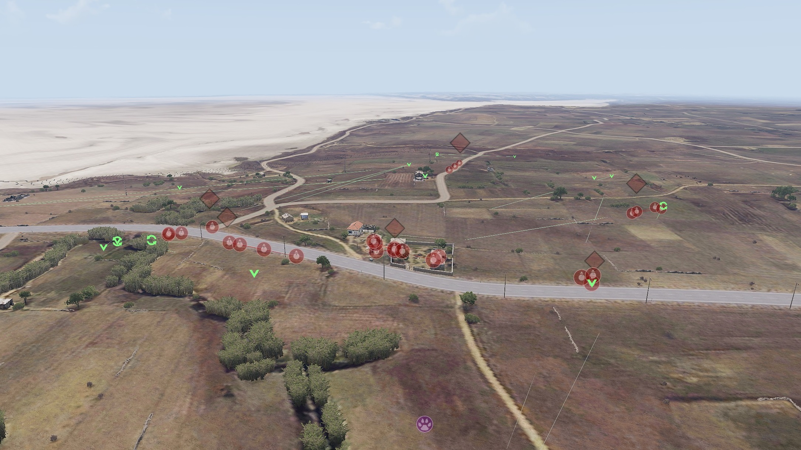

# Overview
Dynamic Squad Mission (DSM) was my first foray into making a code driven mission. I created it at the beginning of 2016. The general idea was to write scripts to create AI units and manage their tactics. To keep things simple in this initial attempt the initial idea was to have some AI spawn in buildings that the players would clear.

It ended up being code that did wrap some pre-existing tools for managing aspects of the AI which I'd like to spread awareness of but also had its own code.

# First Step: Selecting a play location
So to have a play area we need an objective for the AI side to defend. I opted to have preplaced positions using markers and then pick one randomly. Below is an example of the some markers that have been placed in the mission editor.


Each of these locations has at least one building within 125m of the selected marker. At mission start one of these would be randomly selected as the objective for that playthrough.

# Second Step: Creating the AI units
Now we have a location we need to create AI with an initial distribution of AI tasks. I wanted to split the AI across three tasks:
- Garrison on Objective- Some AI would be occupying buildings to defend
- Patrolling AI - Some AI would walk around patrolling the area, perhaps with a bit of luck running into any approaching force
- Guarding AI - Having some AI setup in random positions.

## Creating a Garrison
This is fairly simple and just involves collecting all the buildings within 125m radius. Arma 3 offers a script command for doing this, using the base class of a few building types to ensure these are buildings.

```sqf
private _buildings  = nearestObjects [_centerPos, ["Fortress", "House", "House_Small", "Ruins_F", "BagBunker_base_F", "Stall_base_F"," Shelter_base_F"], 125];
```

The arma 3 engine also enables buildings to be configured with several positions inside the building where units can stand via the [buildingPos](https://community.bistudio.com/wiki/buildingPos) command.

Visualized the building positions look like this (visualized courtesy of [TMF's](https://github.com/tmf3/tmf) Garrison tool):


And if we spawn an AI unit in ever place it would look something like this:


## Creating a Patrolling AI
The next step is adding some AI to patrol the area. There is a scripted function that BI produced called `BIS_fnc_patrol` and the [CBA addon](https://github.com/CBATeam/CBA_A3) add an improved version called `CBA_fnc_patrol`. Both of these creates a sequence of randomly placed *movement* waypoints within a radius of a center point - followed by a *cycle waypoint* so the AI repeat through all movement waypoints.

As each point is generated randomly these patrols can take on any shape, here is an example:


## Guard Waypoint
Arma 3 also offers another useful waypoint type called [guard](https://community.bohemia.net/wiki/Waypoints#Guard). This is pretty powerful and in our context we use it to have the designated AI group remaining at the guard waypoint, but if any other groups get into combat they will signal to groups in guard mode to come and reinforce them.

## Initial State Example
Now that we have the ability to create AI across several tasks. We need to distribute the AI units across these tasks. Firstly I wrote a bit of code that would scale the AI unit numbers based on the number of players.
```sqf
private _aiCount = round ((5 + (_playerCount * AI_RATIO)) min 120); // Ensure maximum of 120 AI
```
The `AI_RATIO` is a mission parameter with a default of `2.2`. So for 10 players this would result in  creating 27 AI units.

These units would then be distributed across the tasks with roughly a quarter in garrison, a third guarding and any leftovers patrolling. Below is an example of 27 units distributed across the three tasks.



# Managing the AI mid-mission
The AI now have some initial tasks but in a real situation a commander would alter the tasks of units under his command to adapt to changing conditions. An example being that if an attacking force was detected arriving from a single direction, it might be worth having units that are not being utilized to assist those that will soon be engaged in combat.

I wrote a basic manager that would monitor all AI groups to see if they were aware of any enemy units. If they became aware of enemies they would call for reinforcements from other groups that were patrolling or otherwise idle. This was easily achieved by maintaining a list of groups on patrol and then removing their existing waypoints and giving them new waypoints to instruct them to moving towards known enemies. After the enemies are eliminated a new sequence of patrol waypoints would be created.

Another key behaviour to instil in the AI and also to ensure that a mission would not draw out is that if the units garrisoning the objective start to take too many casualties all units would fallback to the objective.

This leads to some pretty compelling gameplay where you can be flanked by AI whilst you are in the middle of a firefight.

# Future Plans
As I write this post in 2021 (5 years later) the core of DSM was rewritten by Head into a new mission called [Static Platoon Operation (SPO)](https://github.com/headswe/StaticPlatoonOperation) that expands and rewrites on the initial code.