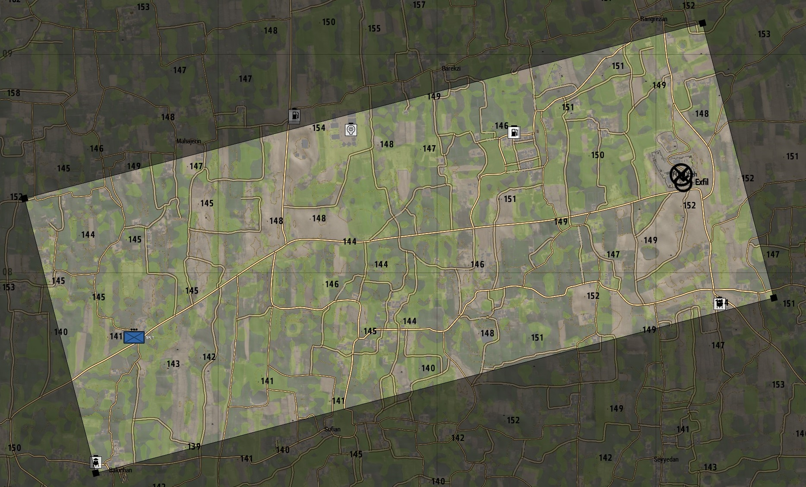
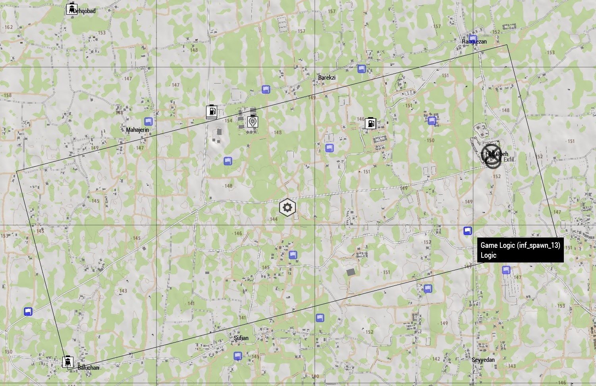
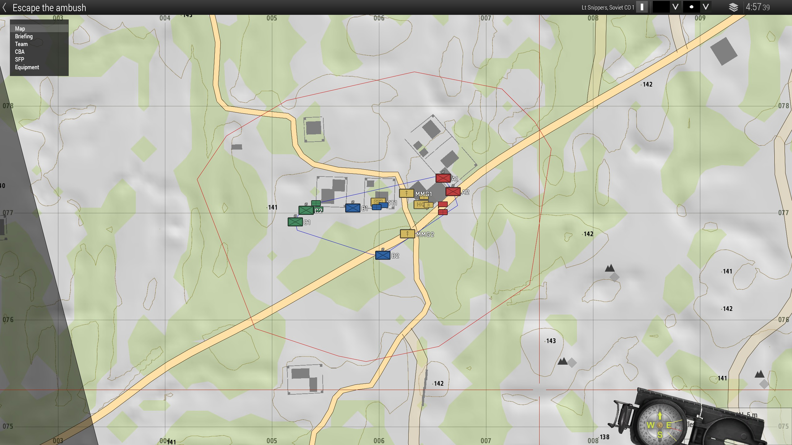
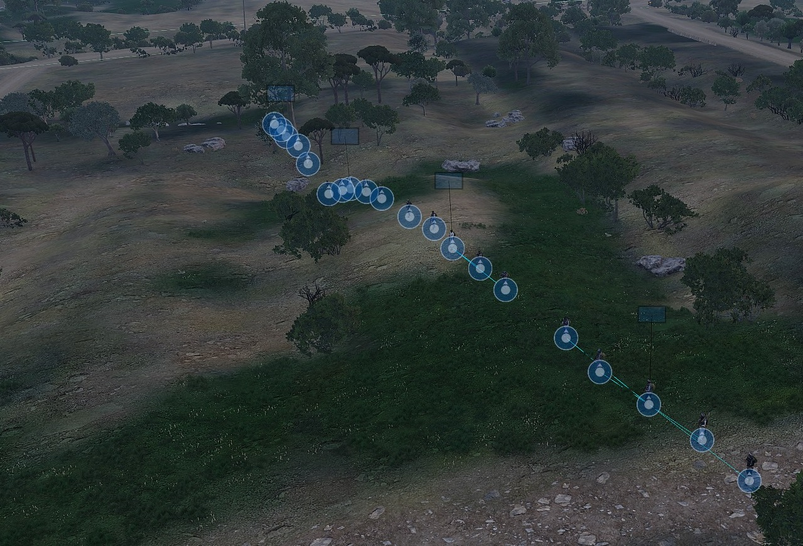
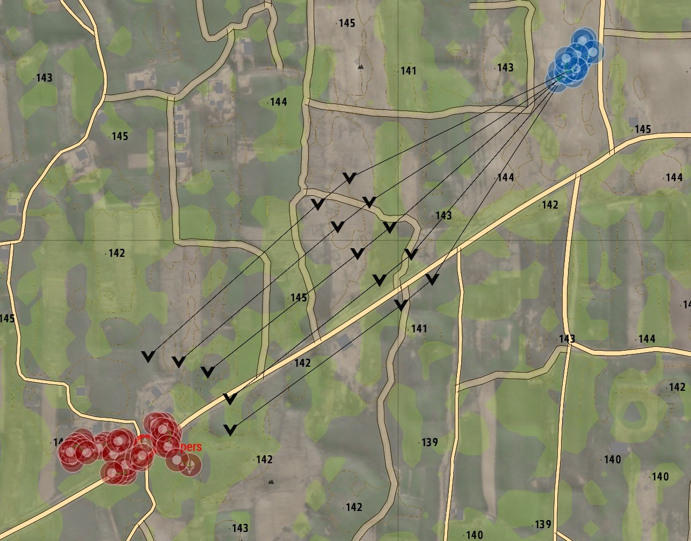
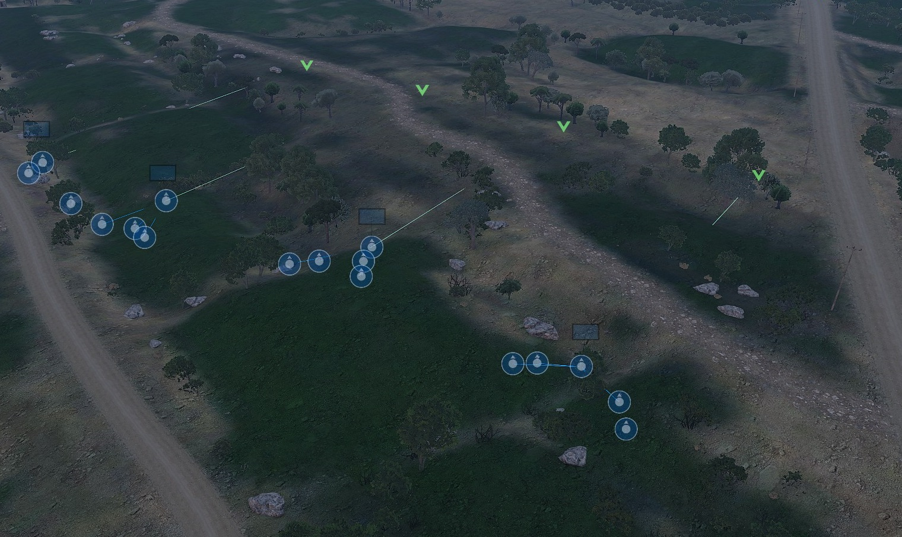
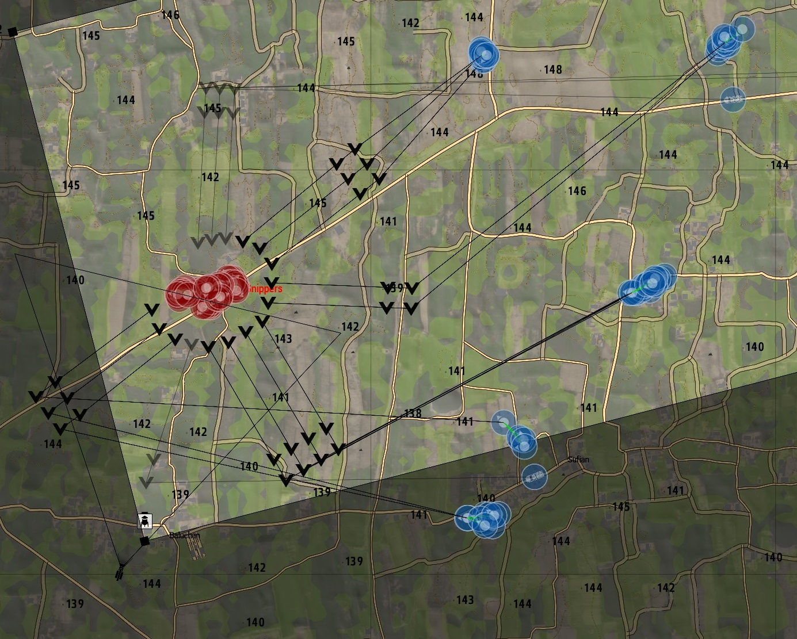
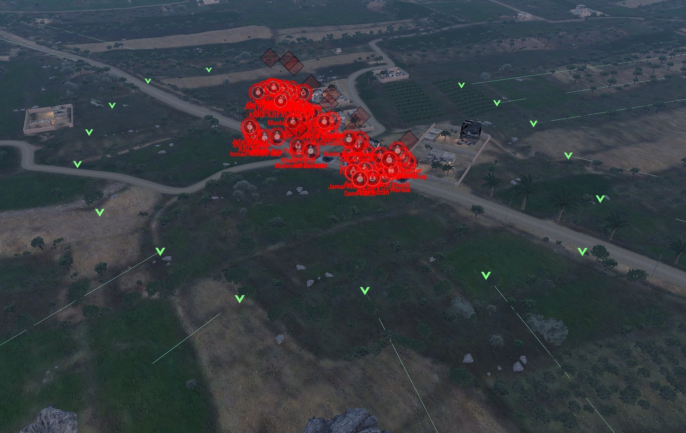

Escape the ambush was an attempt to revisit the concept of the players being pursued as they attempt to escape. The core concept in the mission is a wave manager that will produce waves of enemies that attempt to coordinate an attack on the players.

The idea was to attempt to surround the players at the same time from all sides to help provide something for every player to shoot at. In essence I wanted a dynamic system to enact the role of a macro level AI commander.

## Choosing the mission area
In order for this to work I needed a terrain that would offer plenty of concealment allowing troops to move into positions to stage an attack before getting caught in a firefight. I chose an area in the Anizay terrain that offers average visibility of what I estimate to be around 200-300m which is great for infantry engagements.

### Picking spawn points
The next step is to determine potential locations for the enemies to spawn.

As shown above I have just placed game logic objects (blue squares with a flag icon). The system can pick randomly from these points.

# Setting up the AI Orders

### Destination: Calculating Engagement positions
A simple idea is that ultimately the AI should encircle the players. A simple mathematical tool is producing a [convex hull](https://en.wikipedia.org/wiki/Convex_hull) around the players. This is just a polygon line that surrounds all players (shown as a blue line in the below image).

This convex hull can then be transformed to be bigger polygon of where we want to the AI to be when engaging the players. I'll call this the "Engagement polygon" moving forwards. It is visualized above as a red line in which all points from the convex hull are pushed another 100m away from the center of the polygon.

## Attacking Forces
To use this engagement polygon well on this plan we need to dispatch multiple groups (Fireteams/Squads) of AI to the player.

Arma exposes the ability to add waypoints to groups of AI which the ingame AI will follow. So to get this to work the initial piece of work is to figure out where the units should attack from.

To provide a challenge we need them to space out around the engagement polygon. It's well established in military doctrine that going into a firefight as a big blob is not suitable. We'll aim to spread out the troops across a line formation. As shown below 4 groups of 5 soldiers each in line formation:

To ease things for the AI I also backplaced waypoints for each group behind the final engagement waypoints. As this forces the AI to already be working towards the direction they should be facing to engage. In addition the spacing between the groups waypoints will depend on the group to ensure there is enough room for all the soliders to be in line without groups overlapping.

There is a potential synchronization issue where some groups may move to their waypoints before other groups (see below where the right most group is closer to its engagement point than the others). This can be solved by having some code monitor the groups and ordering groups that are ahead of others to slow down by walking whilst the other groups catching up moving faster by jogging. Which eventually balances itself out.

## Scaling up
To spice things up for the players we want to send multiple groups after the players at the same time. The groups claim a part of the perimeter of the engagement polygon and prevent other groups from it, resulting in a nice encirclement of final waypoints around the players as visualized below:

Now finally as a mission multiple waves are sent to the players, and plans are rebalanced as the players move. Now in practice "No plan survives first contact with the enemy". The players keep moving and the AI lose units. Both of these present their own issues but could be countered in the future. But for the time being the coordinated approach seemed cool enough to release as a mission.

# Appendix 

## Videos

## R3 Recordings
Some selected R3 recordings of playthroughs at 1Tac sessions of the mission:
- [12th Jan 2019 - 13 Players](https://1tac.tk/r3/1583/escape-the-ambush-v4)
- [5th March 2019 - 18 Players](https://1tac.tk/r3/1700/escape-the-ambush-i7-v2)
- [30th August 2019 - 19 players](https://1tac.tk/r3/2213/escape-the-ambush-i7-v2)