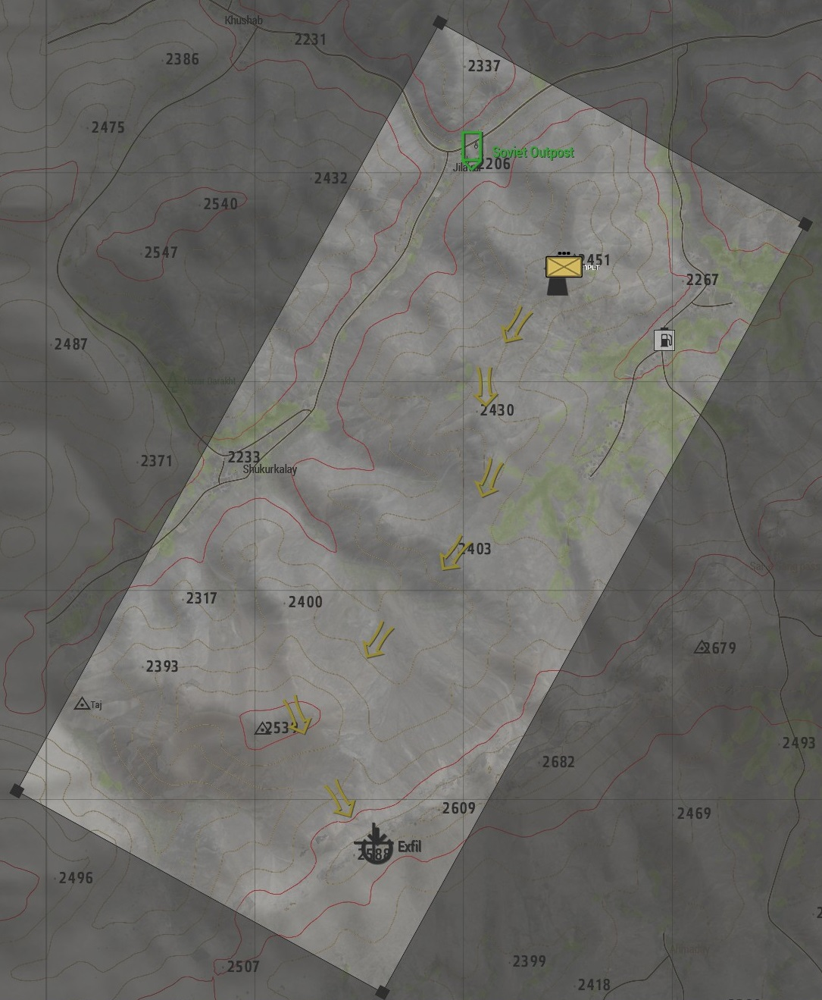
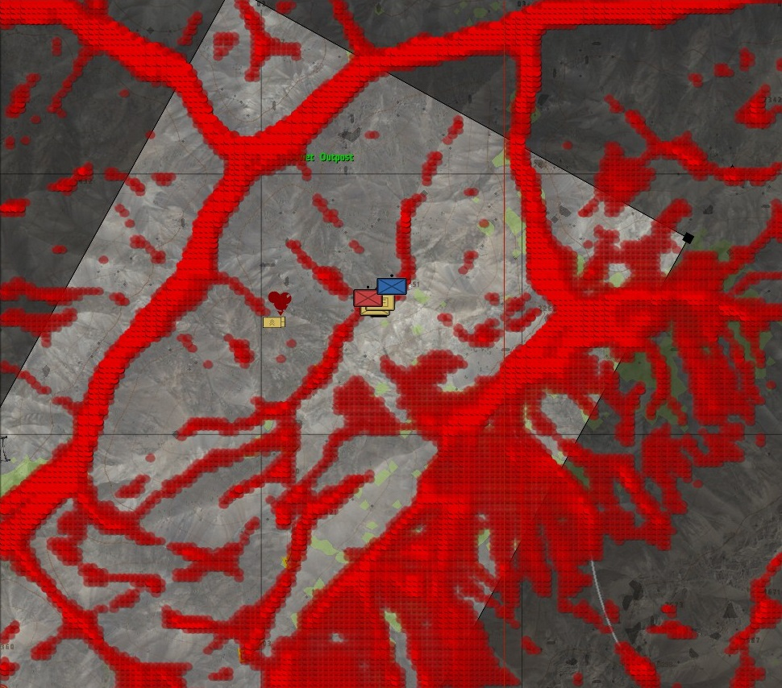
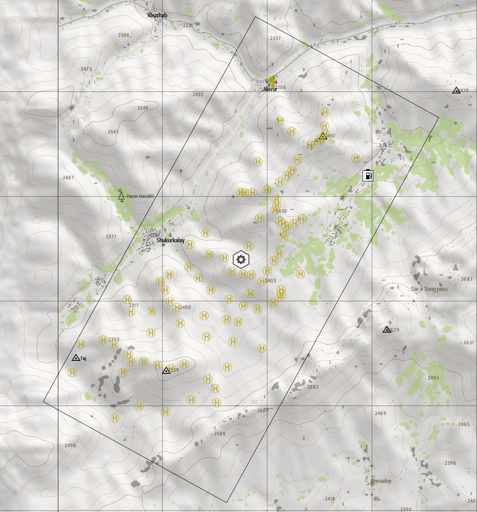
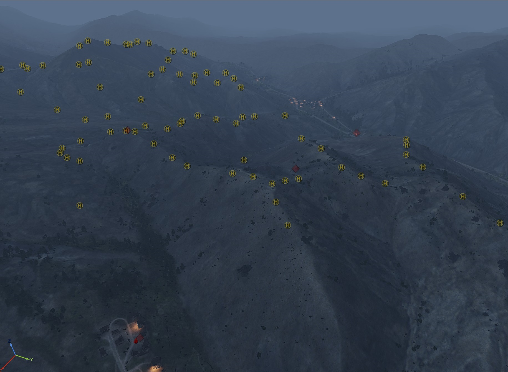
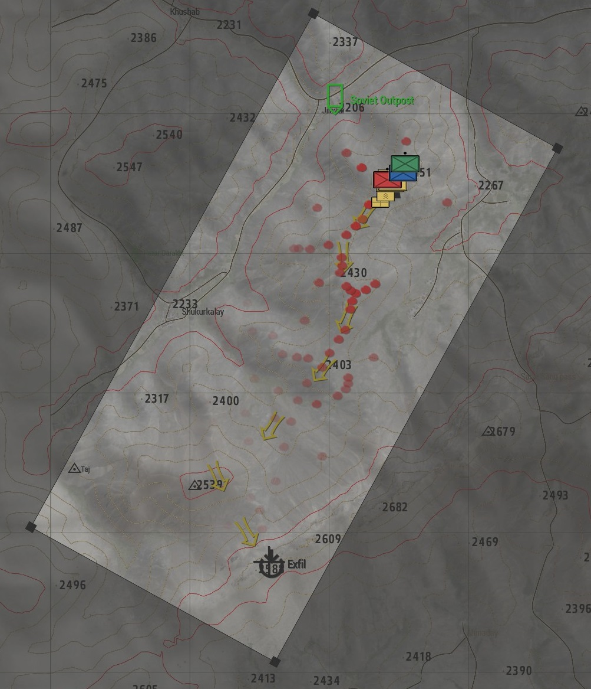
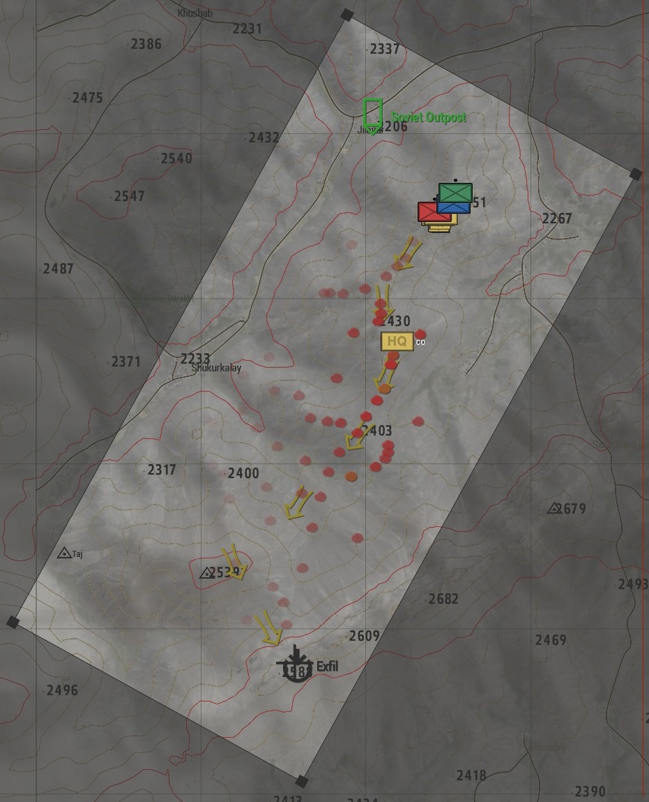
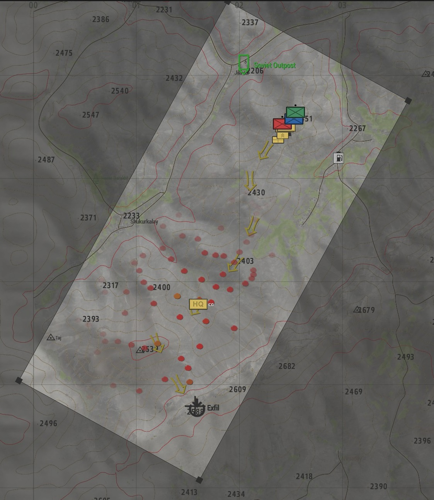
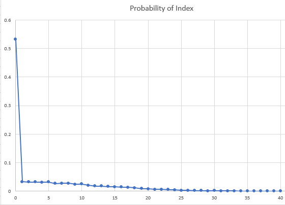

# Mission Premise
The player objective is to escape to the exfil marker on the south side of the map whilst being pursued by soviet forces.



# Enemy design

As always with my Arma AI mission making experiments I wanted to focus on the macro/high level planning of AI movements. The key mechanic I wanted to utilize in this mission was to have a constant stream of enemies appearing to challenge player movements using helicopters.

The simple idea for driving the AI strategy is to every few minutes to dispatch another wave of roughly 4 mi-8 helicopters filled with troops.

## Step 1) Identifying helicopter Landzones (LZ)
One of the key tasks for the AI will be selecting potential landing zones (LZ) for pilots. The first step is to collect a list potential candidates.

These LZs need to be relatively flat areas for the AI to be able to land. They are not capable of landing on slopes like skilled players can. They also big enough to land Mi-8 helicopters.

### Automatic LZ Search
I initially explored algorithmic approaches to find suitable LZs. 

I sampled points across the mission area and compared the heights against neighbouring samples to identify areas with little elevation change. The result of which looking like this.

Red dots were suitable landing positions.

#### Manual LZ Placement
It quickly dawned on me that whilst I could spend more time tailoring the algorithm to identify better candidates I could rapidly manually select LZs in Arma's 3D editor. These would naturally be high quality and could be reasonably spaced out. In addition avoiding the computational cost of searching. 

This was achieved by placing invisible helipad objects in the game across the playable area, (these also encourage Arma AI to land on them). T





## Step 2) Dynamically Choosing Landing zones
We now have a list of LZ candidates. We now to choose appropriate LZs to dispatch helicopters to dismount troops at. The question we now need to address is which LZs do we send the helicopters to.  We need to rank these LZs by calculating a score known as a weight for each candidate using a weighting function.

One of the great things about this being a game is we know exactly where the players are and we know where they are going. This makes it relatively straightforward to select a suitable weighting algorithm. I did try a few but eventually settled on one.

### Weighting Algorithm
It became obvious to me that they were three things I could quantify that would be useful to know. Most of these revolve around the average player position (the mean position of all players). As well as the final objective.

These three factors are the distance from the landing zone to:
- A) To the player goal - We want to favour LZes closer to the finish.
- B) Average player position - We want to favour LZes nearer the players for more engaging gameplay.
- C) Line connecting the average player zone to the goal - We want to favour LZs that give the AI a better chance at intercepting the players.

These three values can be calculated and combined into a single weight function. After some empirical investigation I ended up using the following weighting function:
`LZ Weight = C + ( B / 1.65) + ( A / 5 )`

One of the great things with this approach is that it's really easy to visualize the rankings.

In the following test visualizations the assumed average player position is using the HQ marker. The red/orange dots are the landing zones. The brighter the red the higher the prospective LZ ranks. I have presented three images to show the difference in scores as the players move:

In the above you can see the selected LZs are closer to the top of the image (North), as the HQ marker moves in the next image, the rankings change.

And finally below we can see the higher ranked LZs as the players get close to the exfiltration objective.


### Distribution Selection
Now that we have each landing zone with a score, we can sort them by the weight descending. I also wanted to add some randomness to spice things up. I opted for a random gaussian distribution function as provided through SQF's random command. I also filtered the variable `_positions` (containing the list of sorted candidate LZs) to the top 40 LZes.
```sqf
floor (random [0, 0, count (_positions)])
```
Here is a plot showing the probability of each index being selected from the weight sorted list of LZ candidates.


_Editorial Note: I was aiming for a less steep gradient but did not verify when writing the code but wish to preserve historical accuracy._

## Polishing
Now that we have a system for selecting LZs which this post focuses on. To complete the picture I created some additional pieces of code for:
- Creating helicopters loaded with AI troops that would then creates waypoints for the AI units to follow to land at the LZ (Handled by Arma 3's waypoint system).
- Code for managing ground troops. This was quite simple and would simply order AI units towards the players.

I also added a few ambient patrols and some initial para-dropped troops to add some visual diversity.

# Appendix

## R3 data
These are some R3 playbacks from my Arma community (1Tac) playing the mission
- [9th Jan 2018 - 19 players](https://1tac.tk/r3/507/escape-the-bear-v4)
- [14th Jan 2018 - 26 players](https://1tac.tk/r3/523/escape-the-bear-v4)
- [3rd Jan 2020 - 16 players](https://1tac.tk/r3/2424/escape_the_bear_i236_v1)
- [4th July 2020 - 20 players](https://1tac.tk/r3/2807/escape_the_bear_i236_v3)
- [14 Nov 2020 - 16 players](https://1tac.tk/r3/3169/escape_the_bear_i236_v3)


